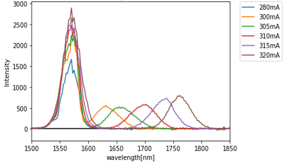
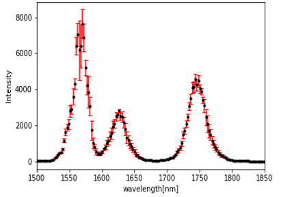

# spectrum

"spectrum" は，spectrusuiteや横河スペクトルアナライザーから得たスペクトルデータをグラフに表示し，保存するためのプログラムです．

"spectrum" には2つのファイルがあり，それぞれ，[spectrusuite](https://github.com/kaito0714/spectrum/blob/main/spectrasuite)用と[横河スペクトルアナライザー](https://github.com/kaito0714/spectrum/blob/main/yokogawa_spectrum)用となっています．

# DEMO
"spectrum" にある2つのファイルでは，以下のような図を作成することが可能です．

複数データを1つのグラフに同時表示

複数データから平均・標準偏差を算出し，エラーバーを表示

# Features

"spectrum"にある各ファイルでは，処理したいファイルが入っているパスを指定することでどのフォルダ内に入っているすべてのファイルを一度に処理し，出力結果を保存することが可能です．

また，データの縦軸に関して，測定器で測定した値だけでなく，その値をログスケールに変換したり，規格化したりする機能があります．

さらに，エラーバーの算出方法には，標準偏差，不偏標準偏差，最大-最小の3つが選択できるようになっています．

# Usage

まずは，setup部分を実行

その後，runの上部にある，各値を設定します．

「range_min,range_max = 16, 528」は固定

x_range_min, x_range_max：表示したい波長範囲を設定

path：処理するフォルダー名を指定

spectrum_name：グラフタイトルを指定

あとは，使いたいタイプに合わせて関数を読み込む

# Author

* 作成者：岡田海門
* 所属：豊田工業大学大学院　工学研究科　先端工学専攻 レーザ科学研究室
* E-mail：sd22405@gmail.com
